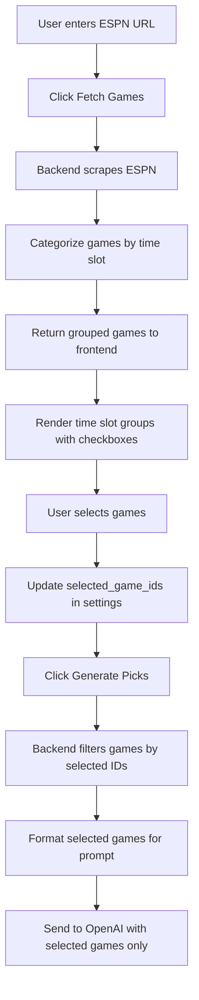

# Game Selection Feature - Architecture Plan

## Overview
Implement a user-friendly game selection interface that allows users to scrape ESPN game data, view games grouped by time slots, and select specific games for analysis.

## Current Limitations
- Games filtered only by text strings (`all`, `afternoon_only`, `early_only`, etc.)
- No visual game selection interface
- No time slot categorization or grouping
- Cannot mix and match games from different time slots

## Proposed Solution

### 1. Time Slot Categories

Games will be automatically categorized into these time slots:

| Time Slot | Time Range (ET) | Example Days | Badge Color |
|-----------|----------------|--------------|-------------|
| **Early Games** | 1:00 PM - 1:30 PM | Sunday | `primary` (blue) |
| **Afternoon Games** | 4:00 PM - 4:30 PM | Sunday | `warning` (orange) |
| **Night Games** | 8:00 PM - 11:00 PM | Sunday | `dark` (black) |
| **Monday Night** | 8:00 PM+ | Monday | `danger` (red) |
| **Thursday Night** | 8:00 PM+ | Thursday | `success` (green) |

### 2. Enhanced ESPN Scraper

**File**: [`app/espn_scraper.py`](app/espn_scraper.py)

#### New `GameData` Class Enhancements
```python
class GameData:
    def __init__(self, away_team: str, home_team: str, time: str, status: str = "Scheduled"):
        self.away_team = away_team
        self.home_team = home_team
        self.time = time
        self.status = status
        self.matchup = f"{away_team} @ {home_team}"
        self.time_slot = self._categorize_time_slot()  # NEW
        self.day_of_week = self._extract_day()  # NEW
        self.game_id = self._generate_game_id()  # NEW
    
    def _categorize_time_slot(self) -> str:
        """Categorize game into time slot based on time string."""
        # Parse time and return: 'early', 'afternoon', 'night', 'monday', 'thursday'
    
    def _extract_day(self) -> str:
        """Extract day of week from ESPN data or infer from time slot."""
        # Return: 'Sunday', 'Monday', 'Thursday', etc.
    
    def _generate_game_id(self) -> str:
        """Generate unique ID: {away_team}_{home_team}_{time_slot}"""
```

### 3. API Endpoints

**File**: [`app/main.py`](app/main.py)

#### 3.1 Enhanced `/api/games` Endpoint
```python
@app.get("/api/games")
async def get_games():
    """
    Returns:
    {
      "metadata": {...},
      "games": [...],
      "time_slots": {
        "early": [...],
        "afternoon": [...],
        "night": [...],
        "monday": [...],
        "thursday": [...]
      }
    }
    """
```

#### 3.2 New `/api/games/select` Endpoint
```python
@app.post("/api/games/select")
async def select_games(game_ids: List[str] = Form(...)):
    """
    Store selected game IDs in settings for prompt generation.
    
    Args:
        game_ids: List of game IDs to analyze
    
    Returns:
        {"success": true, "selected_games": [...]}
    """
```

### 4. Configuration Changes

**File**: [`app/config.py`](app/config.py)

#### Add New Settings
```python
class Settings(BaseSettings):
    # ... existing settings ...
    
    # Game Selection (replaces focus_games string)
    selected_game_ids: List[str] = []  # NEW: Store selected game IDs
    use_game_selection: bool = True  # NEW: Toggle between old/new system
```

### 5. Admin UI Components

**File**: [`templates/admin.html`](templates/admin.html)

#### 5.1 Game Selection Section Structure

```html
<!-- Game Selection Card (NEW) -->
<div class="card mb-4" id="gameSelectionCard" style="display: none;">
    <div class="card-header bg-primary text-white">
        <h5><i class="bi bi-calendar-check"></i> Select Games to Analyze</h5>
    </div>
    <div class="card-body">
        <!-- Fetch Games Button -->
        <button type="button" class="btn btn-info mb-3" id="fetchGamesBtn">
            <i class="bi bi-cloud-download"></i> Fetch Games from ESPN
        </button>
        
        <!-- Loading State -->
        <div id="gamesLoading" style="display: none;">
            <div class="spinner-border text-primary"></div>
            <span>Fetching games...</span>
        </div>
        
        <!-- Game Selection Groups -->
        <div id="gameSelectionContainer"></div>
    </div>
</div>
```

#### 5.2 Time Slot Group Template

```html
<!-- Time Slot Group (repeated for each slot) -->
<div class="game-time-slot mb-4">
    <div class="d-flex align-items-center justify-content-between mb-2">
        <h6 class="mb-0">
            <span class="badge bg-primary">🕐 EARLY GAMES (1:00 PM ET)</span>
        </h6>
        <div class="btn-group btn-group-sm">
            <button class="btn btn-outline-primary select-all-btn">Select All</button>
            <button class="btn btn-outline-secondary deselect-all-btn">Deselect All</button>
        </div>
    </div>
    
    <!-- Game Checkboxes -->
    <div class="game-checkboxes">
        <div class="form-check">
            <input class="form-check-input game-checkbox" 
                   type="checkbox" 
                   value="PHI_WAS_early" 
                   id="game_PHI_WAS_early"
                   data-time-slot="early">
            <label class="form-check-label" for="game_PHI_WAS_early">
                <strong>PHI @ WAS</strong> - 1:00 PM
            </label>
        </div>
    </div>
</div>
```

### 6. Frontend JavaScript Logic

**File**: [`templates/admin.html`](templates/admin.html) (script section)

#### 6.1 Fetch and Display Games
```javascript
async function fetchAndDisplayGames() {
    // 1. Show loading state
    // 2. Fetch from /api/games
    // 3. Group games by time_slot
    // 4. Render time slot groups with checkboxes
    // 5. Attach event listeners
}
```

#### 6.2 Handle Game Selection
```javascript
function updateSelectedGames() {
    // 1. Collect all checked game IDs
    // 2. Update hidden form field
    // 3. Update selection summary
    // 4. Enable/disable generate button
}
```

#### 6.3 Select All/Deselect All
```javascript
document.querySelectorAll('.select-all-btn').forEach(btn => {
    btn.addEventListener('click', function() {
        // Select all games in this time slot
    });
});
```

### 7. Prompt Generation Integration

**File**: [`app/ai_client.py`](app/ai_client.py)

#### Modified `format_games_for_prompt`
```python
def format_games_for_prompt(
    games: List[GameData], 
    selected_game_ids: List[str] = None
) -> str:
    """
    Format game data, filtering by selected game IDs.
    
    Args:
        games: All scraped games
        selected_game_ids: List of game IDs to include (None = all games)
    
    Returns:
        Formatted string with only selected games
    """
    if selected_game_ids:
        filtered_games = [g for g in games if g.game_id in selected_game_ids]
    else:
        filtered_games = games
    
    # Group by time slot for better organization
    # Format output with time slot headers
```

### 8. Data Flow



### 9. UI/UX Enhancements

#### Visual Indicators
- **Time slot badges** with distinct colors
- **Game count** per time slot (e.g., "3 of 5 selected")
- **Selection summary** showing total selected games
- **Empty state** message when no games fetched
- **Error handling** for failed ESPN scrapes

#### Interaction Patterns
1. **Progressive disclosure**: Game selection hidden until ESPN URL entered
2. **Bulk selection**: Select/Deselect all buttons per time slot
3. **Visual feedback**: Checkboxes with hover states
4. **Validation**: Require at least 1 game selected before generation

### 10. Implementation Steps

#### Phase 1: Backend Foundation
1. ✅ Enhance `GameData` class with time slot categorization
2. ✅ Update `scrape_espn_schedule` to extract day/time data
3. ✅ Modify `/api/games` to return grouped games
4. ✅ Add `selected_game_ids` to settings

#### Phase 2: Frontend UI
5. ✅ Create game selection card in admin template
6. ✅ Implement fetch games button and loading state
7. ✅ Build time slot group rendering logic
8. ✅ Add select/deselect all functionality

#### Phase 3: Integration
9. ✅ Connect selected games to prompt generation
10. ✅ Update form submission to include selected game IDs
11. ✅ Modify `render_prompt` to use selected games
12. ✅ Add validation for empty selection

#### Phase 4: Polish
13. ✅ Add visual badges and styling
14. ✅ Implement selection counter
15. ✅ Add error handling and user feedback
16. ✅ Test with various ESPN URLs and time slots

### 11. Backward Compatibility

To maintain compatibility with existing workflows:

```python
# In app/config.py
use_game_selection: bool = True  # Toggle new feature

# In app/ai_client.py
def render_prompt():
    if settings.use_game_selection and settings.selected_game_ids:
        # Use new game selection system
        filtered_games = filter_by_game_ids(games, settings.selected_game_ids)
    else:
        # Fall back to old focus_games string system
        filtered_games = filter_by_focus_string(games, settings.focus_games)
```

### 12. Success Criteria

- [x] Games automatically scraped from ESPN
- [x] Games grouped by time slot (Early/Afternoon/Night/Monday/Thursday)
- [x] User can select individual games via checkboxes
- [x] Bulk select/deselect works per time slot
- [x] Selected games passed to AI prompt generation
- [x] Visual indicators show selection state
- [x] System handles edge cases (no games, all deselected, etc.)

## Files to Modify

1. **[`app/espn_scraper.py`](app/espn_scraper.py:9-25)** - Enhance `GameData` class
2. **[`app/config.py`](app/config.py:6-32)** - Add game selection settings
3. **[`app/main.py`](app/main.py:325-343)** - Enhance `/api/games` endpoint
4. **[`app/ai_client.py`](app/ai_client.py:17-86)** - Update prompt generation
5. **[`templates/admin.html`](templates/admin.html:38-107)** - Add game selection UI

## Timeline Estimate

- **Backend changes**: 2-3 hours
- **Frontend UI**: 3-4 hours
- **Integration & testing**: 2-3 hours
- **Total**: ~8-10 hours

---

## Next Steps

Ready to proceed with implementation? I recommend:

1. **Start with backend** - Enhance ESPN scraper first
2. **Test API endpoint** - Verify game grouping works correctly
3. **Build UI incrementally** - Start with basic checkboxes, add polish later
4. **Test end-to-end** - Ensure selected games flow through to AI prompt