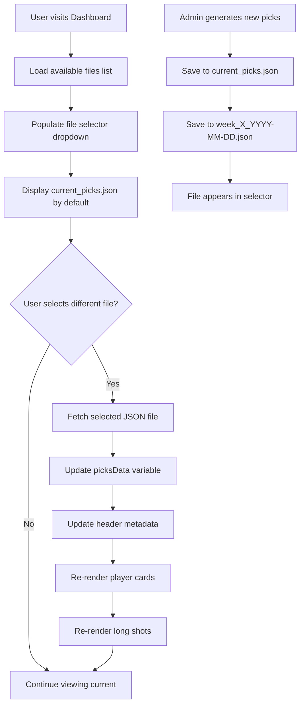

# JSON File Selector Implementation Plan

## Overview
Add a dropdown selector to the dashboard homepage that allows users to switch between different generated JSON files (current and historical picks).

## File Naming Convention
**Format:** `week_{week_number}_{date}.json`
**Example:** `week_13_2024-12-03.json`

This format provides:
- Clear week identification
- Date for disambiguation (multiple generations per week)
- Sortable chronologically
- Human-readable

## Architecture Changes

### 1. Backend Changes (app/ai_client.py)

#### Update `save_picks()` function
```python
def save_picks(picks: WeeklyPicksModel, filepath: str = "app/data/current_picks.json") -> None:
    """
    Save picks to both current_picks.json and a dated historical file.
    
    Args:
        picks: WeeklyPicksModel instance to save.
        filepath: Path to save the current JSON file.
    """
    # Ensure the data directory exists
    data_dir = Path(filepath).parent
    data_dir.mkdir(parents=True, exist_ok=True)
    
    # Save as current_picks.json
    with open(filepath, "w", encoding="utf-8") as f:
        f.write(picks.model_dump_json(indent=2))
    
    # Also save with dated filename for history
    week = picks.meta.week
    date = picks.meta.date  # Expected format: "December 3, 2024" or similar
    # Convert date to YYYY-MM-DD format
    from datetime import datetime
    try:
        date_obj = datetime.strptime(date, "%B %d, %Y")
        date_str = date_obj.strftime("%Y-%m-%d")
    except:
        # Fallback to current date if parsing fails
        date_str = datetime.now().strftime("%Y-%m-%d")
    
    historical_filename = f"week_{week}_{date_str}.json"
    historical_path = data_dir / historical_filename
    
    with open(historical_path, "w", encoding="utf-8") as f:
        f.write(picks.model_dump_json(indent=2))
```

### 2. Backend Changes (app/main.py)

#### Add new API endpoint to list available JSON files
```python
@app.get("/api/picks/list")
async def list_picks_files():
    """
    List all available picks JSON files.
    
    Returns:
        JSON response with list of available files and their metadata.
    """
    try:
        data_dir = Path("app/data")
        json_files = []
        
        # Find all JSON files except current_picks.json
        for file in data_dir.glob("*.json"):
            if file.name == "current_picks.json":
                continue
                
            # Try to extract metadata from filename
            # Format: week_{week_number}_{date}.json
            try:
                parts = file.stem.split("_")
                if len(parts) >= 3 and parts[0] == "week":
                    week_num = parts[1]
                    date_str = "_".join(parts[2:])  # Handle dates with underscores
                    
                    json_files.append({
                        "filename": file.name,
                        "week": int(week_num),
                        "date": date_str,
                        "display_name": f"Week {week_num} - {date_str}"
                    })
            except:
                # If parsing fails, just add the filename
                json_files.append({
                    "filename": file.name,
                    "display_name": file.stem
                })
        
        # Sort by week number (descending) and date (descending)
        json_files.sort(key=lambda x: (x.get("week", 0), x.get("date", "")), reverse=True)
        
        # Add current_picks.json at the top if it exists
        current_picks_path = data_dir / "current_picks.json"
        if current_picks_path.exists():
            json_files.insert(0, {
                "filename": "current_picks.json",
                "display_name": "Current Week (Latest)"
            })
        
        return JSONResponse(content={"files": json_files})
        
    except Exception as e:
        raise HTTPException(status_code=500, detail=f"Error listing picks files: {str(e)}")


@app.get("/api/picks/{filename}")
async def get_picks_by_filename(filename: str):
    """
    Get picks from a specific JSON file.
    
    Args:
        filename: Name of the JSON file to load.
        
    Returns:
        JSON response with picks data.
    """
    try:
        # Security: Only allow files in app/data directory
        filepath = Path("app/data") / filename
        
        # Prevent directory traversal
        if not filepath.resolve().is_relative_to(Path("app/data").resolve()):
            raise HTTPException(status_code=403, detail="Access denied")
        
        picks = load_picks(str(filepath))
        return JSONResponse(content=picks.model_dump())
        
    except FileNotFoundError:
        raise HTTPException(status_code=404, detail=f"File {filename} not found")
    except Exception as e:
        raise HTTPException(status_code=500, detail=f"Error loading picks: {str(e)}")
```

### 3. Frontend Changes (templates/dashboard.html)

#### Add selector dropdown in header section
Replace lines 23-31 with:
```html
<div class="d-flex gap-2">
    <select class="form-select form-select-sm" id="file-selector" style="min-width: 200px;">
        <option value="">Loading files...</option>
    </select>
    <select class="form-select form-select-sm" id="position-filter" style="min-width: 150px;">
        <option value="all">All Positions</option>
        <option value="QB">QB</option>
        <option value="RB">RB</option>
        <option value="WR">WR</option>
        <option value="TE">TE</option>
    </select>
</div>
```

#### Update JavaScript section (after line 72)
```javascript

<script>
// Store picks data
let picksData = {{ picks | tojson }};
let availableFiles = [];

// Load available files on page load
async function loadAvailableFiles() {
    try {
        const response = await fetch('/api/picks/list');
        const data = await response.json();
        availableFiles = data.files;
        
        const selector = document.getElementById('file-selector');
        selector.innerHTML = '';
        
        availableFiles.forEach(file => {
            const option = document.createElement('option');
            option.value = file.filename;
            option.textContent = file.display_name;
            selector.appendChild(option);
        });
        
        // Set current selection to current_picks.json if it exists
        if (availableFiles.length > 0) {
            selector.value = availableFiles[0].filename;
        }
    } catch (error) {
        console.error('Error loading files:', error);
        const selector = document.getElementById('file-selector');
        selector.innerHTML = '<option value="">Error loading files</option>';
    }
}

// Load picks from selected file
async function loadPicksFromFile(filename) {
    try {
        const response = await fetch(`/api/picks/${filename}`);
        if (!response.ok) {
            throw new Error('Failed to load picks');
        }
        
        picksData = await response.json();
        
        // Update header metadata
        updateHeaderMetadata();
        
        // Re-render cards
        renderPlayerCards();
        renderLongShotCards();
        
    } catch (error) {
        console.error('Error loading picks:', error);
        alert('Failed to load picks from selected file');
    }
}

// Update header metadata display
function updateHeaderMetadata() {
    const metaContainer = document.querySelector('.d-flex.align-items-center.gap-2');
    if (metaContainer && picksData.meta) {
        metaContainer.innerHTML = `
            <span class="badge bg-primary">Week ${picksData.meta.week}</span>
            <span class="badge bg-info">${picksData.meta.date}</span>
            <span class="badge bg-secondary">${picksData.meta.slate_description}</span>
        `;
    }
}

// File selector event listener
document.getElementById('file-selector').addEventListener('change', function() {
    const selectedFile = this.value;
    if (selectedFile) {
        loadPicksFromFile(selectedFile);
    }
});

// Render player cards
function renderPlayerCards() {
    const container = document.getElementById('players-container');
    const positionFilter = document.getElementById('position-filter').value;
    container.innerHTML = '';
    
    // Combine all players
    let allPlayers = [];
    ['qbs', 'rbs', 'wrs', 'tes'].forEach(position => {
        if (picksData.categories[position]) {
            allPlayers = allPlayers.concat(picksData.categories[position]);
        }
    });
    
    // Apply filter
    if (positionFilter !== 'all') {
        allPlayers = allPlayers.filter(p => p.position === positionFilter);
    }
    
    if (allPlayers.length === 0) {
        container.innerHTML = '<p class="text-muted">No players available for the selected position.</p>';
        return;
    }
    
    // Render each player
    allPlayers.forEach(player => {
        container.appendChild(createPlayerCard(player));
    });
}

// Create player card element
function createPlayerCard(player) {
    const card = document.createElement('div');
    card.className = 'player-card';
    
    // Injury status
    const injuryClass = (player.injury_status || 'active').replace(/_/g, '-');
    const injuryLabel = (player.injury_status || 'active').replace(/_/g, ' ');
    
    // Suggestions HTML
    let suggestionsHtml = '';
    if (player.suggestions && player.suggestions.length > 0) {
        const badges = player.suggestions.map(s => {
            const statName = s.stat.replace(/_/g, ' ');
            if (s.type === 'yes_no') {
                return `<span class="suggestion-badge ${s.lean}">
                    <span class="suggestion-stat">${statName}</span>
                    <span class="suggestion-lean">${s.lean}</span>
                </span>`;
            } else {
                const leanClass = s.lean === 'over' ? 'over' : 'under';
                return `<span class="suggestion-badge ${leanClass}">
                    <span class="suggestion-stat">${statName}</span>
                    <span class="suggestion-line">${s.line}</span>
                    <span class="suggestion-lean">${s.lean}</span>
                </span>`;
            }
        }).join('');
        suggestionsHtml = `<div class="player-suggestions">${badges}</div>`;
    }
    
    // Sources HTML
    let sourcesHtml = '';
    if (player.sources && player.sources.length > 0) {
        const tags = player.sources.map(src => {
            const sentimentClass = src.sentiment === '+1' ? 'source-positive' :
                                  src.sentiment === '-1' ? 'source-negative' : 'source-neutral';
            return `<span class="source-tag ${sentimentClass}">${src.name}</span>`;
        }).join('');
        sourcesHtml = `<div class="sources-list">${tags}</div>`;
    }
    
    card.innerHTML = `
        <div class="player-header">
            <span class="player-position ${player.position.toLowerCase()}">${player.position}</span>
            <span class="player-name">${player.name}</span>
            <span class="injury-badge ${injuryClass}">${injuryLabel}</span>
            ${player.verified ? '<span class="verified-badge">✓ Verified</span>' : ''}
        </div>
        <div class="player-meta">
            <span class="player-team">${player.team}</span>
            <span>${player.game}</span>
        </div>
        <div class="player-note">${player.matchup_note}</div>
        ${player.what_to_target ? `<div class="player-target">🎯 ${player.what_to_target}</div>` : ''}
        ${player.why ? `<div class="player-why">${player.why}</div>` : ''}
        ${suggestionsHtml}
        ${sourcesHtml}
    `;
    
    return card;
}

// Render long shot cards
function renderLongShotCards() {
    const container = document.getElementById('long-shots-container');
    if (!container) return;
    
    const positionFilter = document.getElementById('position-filter').value;
    container.innerHTML = '';
    
    let players = picksData.long_shots.players || [];
    
    // Apply filter
    if (positionFilter !== 'all') {
        players = players.filter(p => p.position === positionFilter);
    }
    
    if (players.length === 0) {
        container.innerHTML = '<p class="text-muted">No long shot data available for the selected position.</p>';
        return;
    }
    
    players.forEach(player => {
        const card = document.createElement('div');
        card.className = 'player-card';
        
        card.innerHTML = `
            <div class="player-header">
                <span class="player-position ${player.position.toLowerCase()}">${player.position}</span>
                <span class="player-name">${player.name}</span>
                <span class="verified-badge">Long Shot</span>
            </div>
            <div class="player-meta">
                <span class="player-team">${player.team}</span>
                <span>${player.game}</span>
            </div>
            <div class="player-note">
                <strong>Long Shot:</strong> ${player.long_shot.label}<br>
                <strong>Ultra Long Shot:</strong> ${player.ultra_long_shot.label}
            </div>
        `;
        
        container.appendChild(card);
    });
}

// Position filter event listener
document.getElementById('position-filter').addEventListener('change', function() {
    renderPlayerCards();
    renderLongShotCards();
});

// Initial setup
loadAvailableFiles();
renderPlayerCards();
renderLongShotCards();
</script>

```

## Implementation Flow



## Testing Checklist

- [ ] Generate picks and verify both files are created
- [ ] Verify historical filename format is correct
- [ ] Test `/api/picks/list` endpoint returns all files
- [ ] Test `/api/picks/{filename}` endpoint loads correct data
- [ ] Test file selector dropdown populates correctly
- [ ] Test switching between files updates the display
- [ ] Test position filter works with different files
- [ ] Test security: directory traversal prevention
- [ ] Test error handling for missing files
- [ ] Test with multiple historical files

## Documentation Updates

Add to README.md or QUICKSTART.md:

### Historical Picks Storage

Generated picks are automatically saved in two locations:
1. `app/data/current_picks.json` - Always contains the most recent generation
2. `app/data/week_{week_number}_{date}.json` - Historical archive (e.g., `week_13_2024-12-03.json`)

### Viewing Historical Picks

Use the file selector dropdown in the dashboard header to switch between current and historical picks. The dropdown shows:
- "Current Week (Latest)" - Most recent generation
- Historical entries sorted by week and date (newest first)

## Benefits

1. **User Experience**: Easy access to historical data without manual file management
2. **Data Preservation**: Automatic archival of all generations
3. **Comparison**: Users can compare picks across weeks
4. **Audit Trail**: Complete history of generated picks
5. **Flexibility**: Can view any past week's recommendations