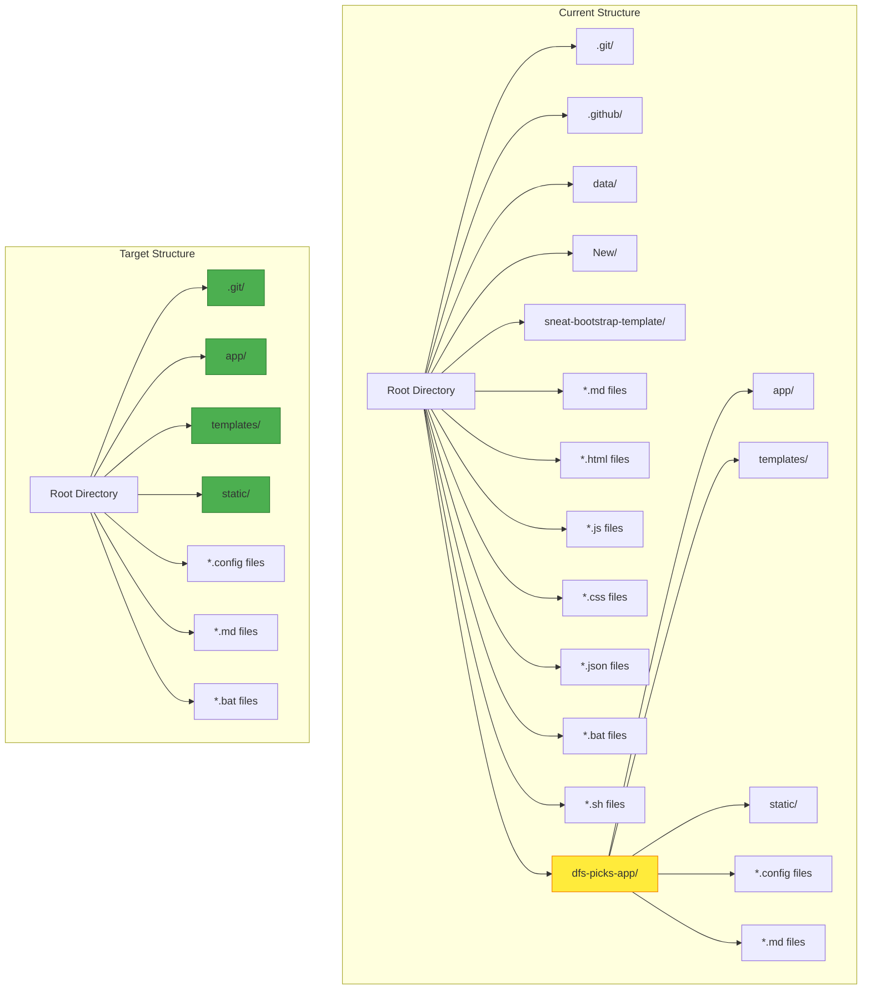
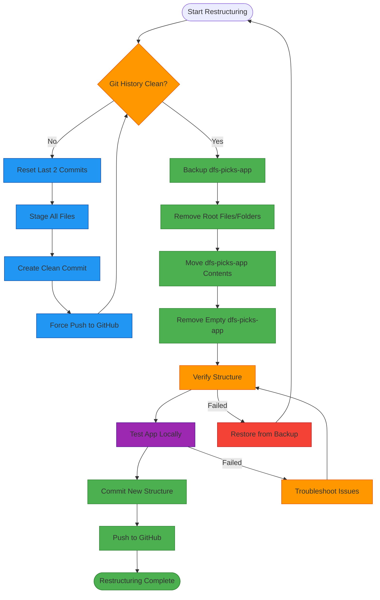
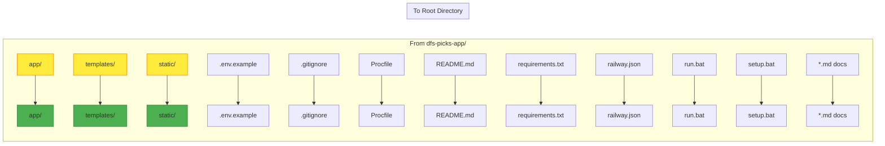
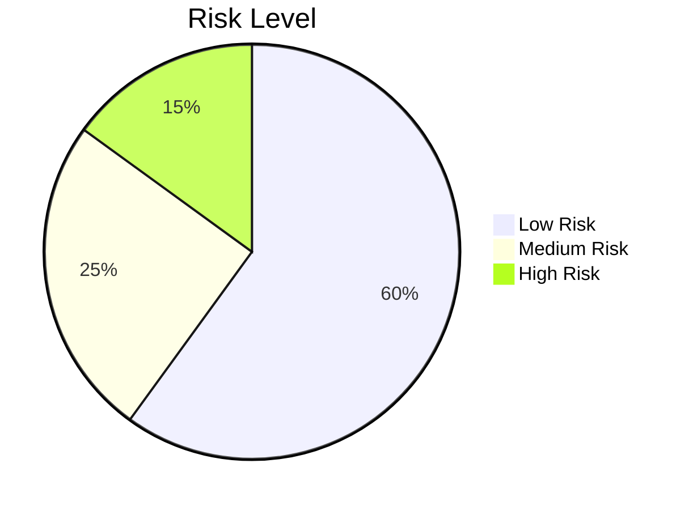

# 📊 Project Restructuring Visualization

## 🔄 Current vs Target Structure



## 🚀 Execution Flow



## 📁 File Movement Map



## ⚠️ Risk Assessment



**Low Risk (60%):**
- File movement operations
- Directory creation/removal
- Local testing

**Medium Risk (25%):**
- Git history rewrite
- Force push operations
- Path reference updates

**High Risk (15%):**
- Data loss during restructuring
- Breaking app functionality
- Deployment issues

## 🎯 Success Criteria Checklist

```mermaid
graph TD
    Success([Restructuring Success]) --> Criteria1[Git History Clean]
    Success --> Criteria2[All Files Moved Correctly]
    Success --> Criteria3[App Runs Locally]
    Success --> Criteria4[No Broken Imports]
    Success --> Criteria5[Dashboard Loads]
    Success --> Criteria6[Admin Interface Works]
    Success --> Criteria7[API Endpoints Respond]
    Success --> Criteria8[Deployed Successfully]
    
    style Success fill:#4caf50,stroke:#2e7d32
    style Criteria1 fill:#81c784,stroke:#4caf50
    style Criteria2 fill:#81c784,stroke:#4caf50
    style Criteria3 fill:#81c784,stroke:#4caf50
    style Criteria4 fill:#81c784,stroke:#4caf50
    style Criteria5 fill:#81c784,stroke:#4caf50
    style Criteria6 fill:#81c784,stroke:#4caf50
    style Criteria7 fill:#81c784,stroke:#4caf50
    style Criteria8 fill:#81c784,stroke:#4caf50